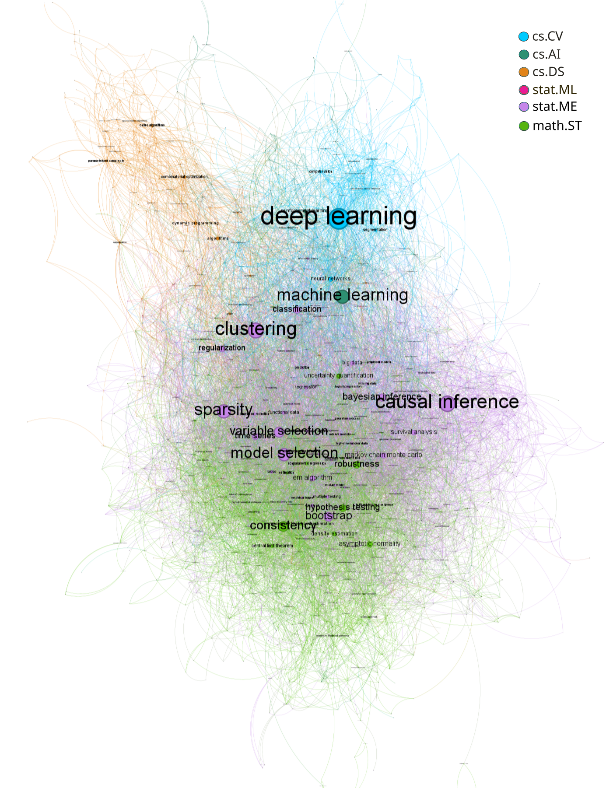
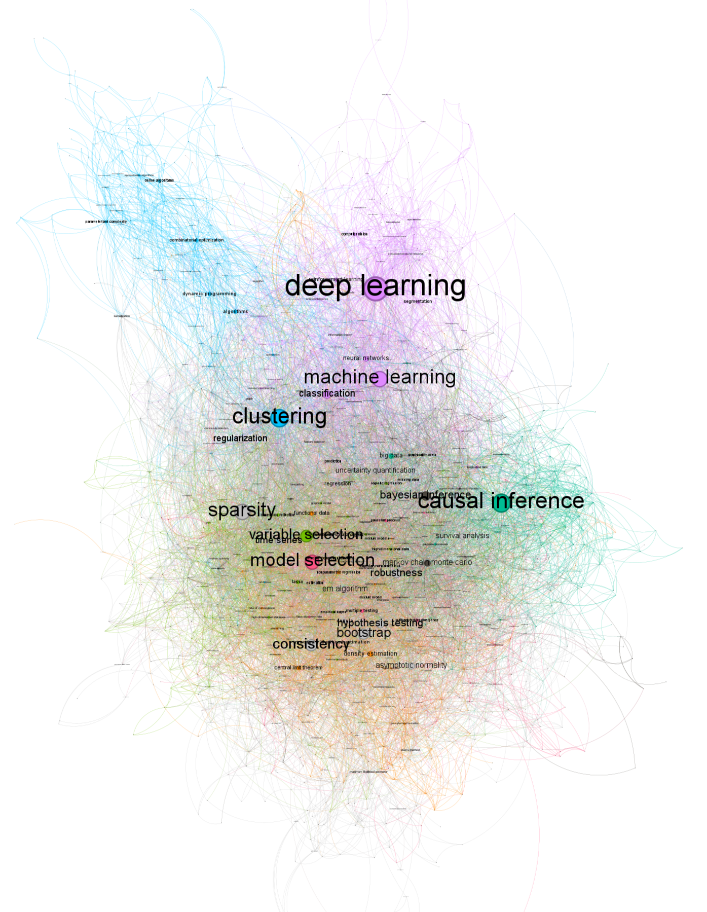

# **Scientific Article Keyword Network Analysis**

## **Overview**
The aim of the project is exploring the relationship between the keywords from different scientific articles from various domains through network analysis. We visualize the keywords, which are extracted from articles in [**arXiv**](https://arxiv.org/), as a network, which enables us to reveal connections and overlaps across different scientific categories.

## **Features**
- **Keyword Network**: Visualizes connections between keywords based on their co-occurrence in scientific articles.
- **Node Properties**:
  - **Size**: Reflects the betweenness centrality of the keyword.
  - **Color**: Represents the most frequent category in which the keyword appears.
- **Edge Properties**:
  - **Color**: Determined by the colors of the connected nodes, indicating cross-category connections.
 
## **Community Detection and Modularity**
- **Community Visualization**: The network includes a visualization where keywords are colored based on communities identified using the [**Louvain method**](https://en.wikipedia.org/wiki/Louvain_method).
- **Force Atlas 3D Layout**: Nodes are positioned using the Force Atlas 3D algorithm, with their size determined by betweenness centrality.
- **Modularity Insights**: 
  - The communities identified through modularity partially align with the original categories of the articles.
  - The exploratory analysis suggests that classification across different macro-areas using abstracts and keywords could be effective, whereas classification within the same macro-area (e.g., Statistics) might be more challenging.

  
  

## **Getting Started**
To explore the keyword network and compare the community structures, follow the links below:

- [**View the Keyword Network**](https://francescofreni.github.io/keywords_network/network/)
- [**View the Community-Based Network**](https://francescofreni.github.io/keywords_network/networkmod/)

## **References**
- Bastian, M., Heymann, S., & Jacomy, M. (2009). Gephi: An Open Source Software for Exploring and Manipulating Networks.
